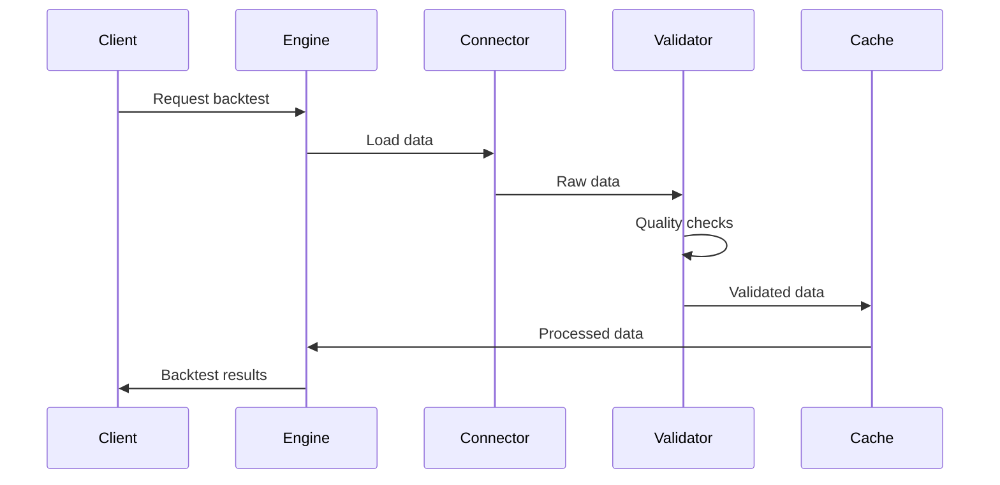
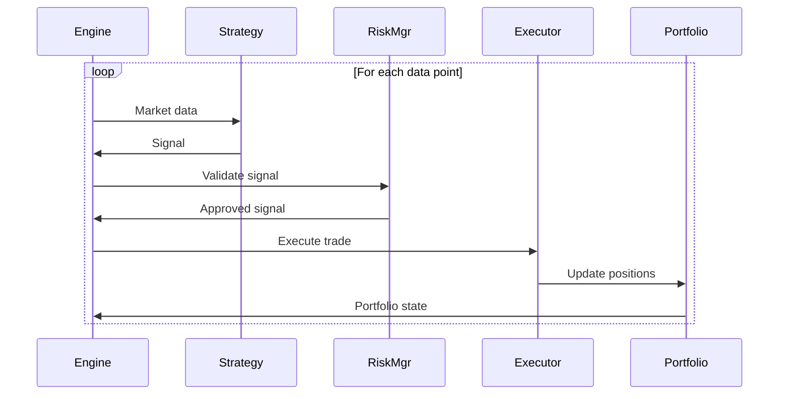

# System Architecture Overview

## 🏗️ **High-Level Architecture**

The Ultimate Backtesting Engine follows a modular, enterprise-grade architecture designed for scalability, reliability, and performance.

### **Architecture Principles**

1. **Separation of Concerns** - Each module has a single responsibility
2. **Dependency Injection** - Loose coupling between components
3. **Configuration-Driven** - Environment-specific behavior
4. **Security-First** - Built-in security at every layer
5. **Observability** - Comprehensive monitoring and logging
6. **Performance-Optimized** - Vectorized operations and parallel processing

---

## 🎯 **Core Components**

### **1. Data Layer**

**Purpose**: Unified data access and management

**Components**:
- **Data Connectors**: Interface with external data sources
- **Data Validation**: Quality control and consistency checks
- **Data Caching**: Optimized storage and retrieval
- **Data Formatting**: Standardized data structures

**Key Features**:
- Multi-source data integration
- Real-time data quality monitoring
- Automatic data cleaning and correction
- Efficient caching mechanisms

```python
# Data Layer Interface
class DataConnector(ABC):
    @abstractmethod
    def load_data(self, symbol: str, start: str, end: str) -> pd.DataFrame:
        pass
    
    @abstractmethod
    def validate_data(self, data: pd.DataFrame) -> ValidationResult:
        pass
```

### **2. Core Engine**

**Purpose**: Central backtesting orchestration

**Components**:
- **Backtest Engine**: Main execution coordinator
- **Execution Simulator**: Realistic trade execution
- **Portfolio Manager**: Position and capital tracking
- **Risk Manager**: Real-time risk controls

**Key Features**:
- Event-driven simulation
- Realistic execution modeling
- Dynamic risk management
- Performance optimization

```python
# Core Engine Interface
class BacktestEngine:
    def run_backtest(self, strategy: BaseStrategy, data: pd.DataFrame) -> Dict:
        # Orchestrate complete backtesting workflow
        pass
```

### **3. Strategy Framework**

**Purpose**: Flexible strategy development and execution

**Components**:
- **Base Strategy**: Abstract strategy interface
- **Strategy Library**: Pre-built strategies
- **Parameter Management**: Dynamic parameter handling
- **Signal Generation**: Unified signal interface

**Key Features**:
- Plugin architecture for strategies
- Parameter optimization support
- Multi-timeframe capabilities
- Custom indicator support

### **4. Testing & Validation**

**Purpose**: Comprehensive strategy testing

**Components**:
- **Walk-Forward Analysis**: Out-of-sample validation
- **Monte Carlo Simulation**: Robustness testing
- **Stress Testing**: Extreme scenario analysis
- **Sensitivity Analysis**: Parameter stability

**Key Features**:
- Statistical significance testing
- Multiple validation methodologies
- Parallel test execution
- Comprehensive reporting

### **5. AI & Analysis**

**Purpose**: Intelligent analysis and optimization

**Components**:
- **Claude AI Assistant**: Strategy analysis and optimization
- **Metrics Calculator**: Performance measurement
- **Report Generator**: Automated reporting
- **Pattern Recognition**: Trade pattern analysis

**Key Features**:
- Natural language analysis
- Automated insights generation
- Custom metric definitions
- Interactive reporting

### **6. Infrastructure**

**Purpose**: Enterprise-grade operational capabilities

**Components**:
- **Security Manager**: Authentication and encryption
- **Monitoring System**: Real-time system monitoring
- **Error Handling**: Comprehensive error management
- **Performance Optimizer**: System optimization

**Key Features**:
- Zero-trust security model
- Real-time alerting
- Automatic error recovery
- Performance profiling

---

## 🔄 **Data Flow Architecture**

### **Data Ingestion Flow**



### **Strategy Execution Flow**



---

## 🏛️ **Layered Architecture**

### **Layer 1: Presentation**
- **CLI Interface**: Command-line interface
- **Web Dashboard**: Real-time monitoring
- **API Endpoints**: RESTful API
- **Reports**: Generated outputs

### **Layer 2: Application**
- **Backtest Engine**: Core logic
- **Strategy Manager**: Strategy orchestration
- **Test Coordinator**: Testing framework
- **Analysis Engine**: Results analysis

### **Layer 3: Domain**
- **Strategy Models**: Business logic
- **Market Models**: Financial instruments
- **Risk Models**: Risk calculations
- **Performance Models**: Metrics

### **Layer 4: Infrastructure**
- **Data Access**: Database connections
- **External APIs**: Third-party integrations
- **Caching**: Redis/Memory cache
- **Logging**: Structured logging

### **Layer 5: Cross-Cutting**
- **Security**: Authentication/Authorization
- **Monitoring**: Observability
- **Configuration**: Environment management
- **Error Handling**: Exception management

---

## 🔧 **Design Patterns**

### **1. Strategy Pattern**
Used for different backtesting strategies and execution models.

```python
class ExecutionModel(ABC):
    @abstractmethod
    def execute_trade(self, signal: float, market_data: Dict) -> Trade:
        pass

class RealisticExecution(ExecutionModel):
    def execute_trade(self, signal: float, market_data: Dict) -> Trade:
        # Implement realistic execution with slippage
        pass
```

### **2. Observer Pattern**
Used for real-time monitoring and event handling.

```python
class BacktestObserver(ABC):
    @abstractmethod
    def on_trade_executed(self, trade: Trade):
        pass

class PerformanceMonitor(BacktestObserver):
    def on_trade_executed(self, trade: Trade):
        # Update performance metrics
        pass
```

### **3. Factory Pattern**
Used for creating different types of strategies and connectors.

```python
class StrategyFactory:
    @staticmethod
    def create_strategy(strategy_type: str) -> BaseStrategy:
        strategies = {
            'momentum': MomentumStrategy,
            'mean_reversion': MeanReversionStrategy,
            'microstructure': MicrostructureStrategy
        }
        return strategies[strategy_type]()
```

### **4. Decorator Pattern**
Used for performance monitoring and error handling.

```python
@performance_monitor
@error_handler_decorator(category=ErrorCategory.CALCULATION_ERROR)
def calculate_sharpe_ratio(returns: np.ndarray) -> float:
    # Calculate Sharpe ratio
    pass
```

---

## 🚀 **Scalability Considerations**

### **Horizontal Scaling**
- **Microservices**: Decomposable components
- **Load Balancing**: Distribute processing load
- **Message Queues**: Asynchronous processing
- **Container Orchestration**: Kubernetes deployment

### **Vertical Scaling**
- **Multi-threading**: Parallel processing
- **Memory Optimization**: Efficient data structures
- **CPU Optimization**: Vectorized operations
- **I/O Optimization**: Async operations

### **Data Scaling**
- **Partitioning**: Time-based data partitioning
- **Compression**: Efficient data storage
- **Indexing**: Fast data retrieval
- **Caching**: Multi-level caching strategy

---

## 🔒 **Security Architecture**

### **Defense in Depth**
1. **Network Security**: VPC, firewalls, encryption in transit
2. **Application Security**: Input validation, authentication
3. **Data Security**: Encryption at rest, access controls
4. **Infrastructure Security**: Hardened containers, monitoring

### **Security Components**
- **Identity & Access Management**: Role-based access control
- **Encryption**: AES-256 encryption for sensitive data
- **Audit Logging**: Comprehensive audit trails
- **Vulnerability Management**: Regular security scanning

---

## 📊 **Performance Architecture**

### **Performance Optimization Strategies**
1. **Vectorization**: NumPy/Numba optimized calculations
2. **Parallel Processing**: Multi-core utilization
3. **Memory Management**: Efficient data structures
4. **Caching**: Intelligent caching strategies
5. **Lazy Loading**: Load data on demand

### **Performance Monitoring**
- **Real-time Metrics**: CPU, memory, I/O monitoring
- **Performance Profiling**: Function-level profiling
- **Bottleneck Detection**: Automated performance analysis
- **Capacity Planning**: Resource usage forecasting

---

## 🔧 **Technology Stack**

### **Core Technologies**
- **Python 3.11+**: Main programming language
- **NumPy/Pandas**: Data manipulation and analysis
- **Numba**: JIT compilation for performance
- **AsyncIO**: Asynchronous programming

### **Data Storage**
- **PostgreSQL**: Primary database
- **Redis**: Caching layer
- **Parquet**: Data file format
- **HDF5**: High-performance data storage

### **Infrastructure**
- **Docker**: Containerization
- **Kubernetes**: Container orchestration
- **Prometheus**: Metrics collection
- **Grafana**: Monitoring dashboards

### **External Integrations**
- **Databento API**: Market data
- **NinjaTrader**: Execution data
- **Claude API**: AI analysis
- **QuantConnect**: Alternative data

---

*This architecture is designed to be production-ready, scalable, and maintainable while providing world-class backtesting capabilities.*